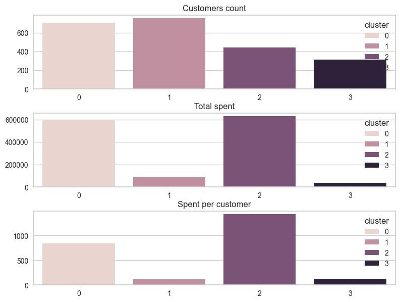

# Сегментация клиентов

## Описание проекта  
Цель проекта — сегментировать клиентов на основе их демографических характеристик, покупательского поведения и взаимодействия с маркетинговыми кампаниями. Это позволит выявить группы клиентов с разными потребностями и сформировать более точечные маркетинговые стратегии.  

- **Данные:** [Kaggle](https://www.kaggle.com/datasets/imakash3011/customer-personality-analysis)  
- **Полная версия:** [Jupyter Notebook](ClientsSegmentation.ipynb)  

## Этапы работы  

### 1. Предобработка данных  
- Обнаружены и обработаны пропущенные значения.  
- Выявлены выбросы в доходах клиентов и скорректированы.  
- Созданы новые признаки:  
  - **Размер семьи** (учитывает детей и взрослых).  
  - **Стаж клиента** (количество дней с момента первой покупки).  
  - **Общая сумма трат** по всем категориям товаров.  
  - **Возраст клиента** (рассчитан на основе года рождения).  
- Категориальные переменные преобразованы через **one-hot encoding**.  

### 2. Разведочный анализ (EDA)  
- Исследована возрастная структура клиентов.  
- Проанализировано распределение доходов и покупательского поведения.  
- Оценено участие клиентов в маркетинговых кампаниях.  
- Построена корреляционная матрица для выявления зависимостей между переменными.  
- 
### 3. Кластеризация клиентов  
- Данные стандартизированы через **StandardScaler**.  
- PCA снижает размерность до **трёх главных компонент**.  
- Оптимальное число кластеров определено через **метод локтя** (**4 кластера**).
  

  
- Использована **агломеративная кластеризация (AgglomerativeClustering)**.  
  

  

### 4. Анализ кластеров

  Для наглядного понимания различий между кластерами представлены два ключевых графика:
  

  

  - **Три графика**, отображающих количество клиентов, их общие расходы и средние траты на одного клиента по каждому кластеру. Это позволяет увидеть относительную значимость каждого сегмента и его покупательскую способность.
   

   - **Корреляционная матрица**, демонстрирующая связи между различными переменными внутри кластеров. Позволяет выявить ключевые факторы, определяющие поведение клиентов в каждом сегменте.

Основыне характеристики кластеров:
- **Кластер 0**: Клиенты среднего достатка, активно совершающие покупки в интернете и участвующие в акциях. Они проявляют интерес к скидкам и регулярно посещают сайт.  
- **Кластер 1**: Группа с наименьшими доходами и расходами. Они мало участвуют в маркетинговых кампаниях, но часто заходят на сайт, не совершая покупок.  
- **Кластер 2**: Клиенты с высокими доходами, предпочитающие делать значительные покупки, но без участия в акциях. Основной канал приобретения — каталог.  
- **Кластер 3**: Покупатели с низкими доходами, совершающие покупки в основном через интернет. Уровень вовлеченности в акции и маркетинговые кампании невысокий.  

### 5. Выводы и рекомендации  
- **Таргетирование маркетинговых кампаний**:  
  - Для кластера 0 — усилить онлайн-акции и разработать программу лояльности.  
  - Для кластера 1 — не является приоритетной аудиторией. Можно исключить их из активных маркетинговых кампаний, сосредоточившись на более платежеспособных сегментах.  
  - Для кластера 2 — ориентироваться на премиум-продукты и эксклюзивные предложения.  
  - Для кластера 3 — данный сегмент не является целевым, маркетинговая активность может быть сведена к минимуму, за исключением базовых уведомлений.   
  
## Используемые инструменты  
- **Язык программирования**: Python  
- **Библиотеки**: pandas, numpy, matplotlib, seaborn, scikit-learn, yellowbrick  
- **Методы машинного обучения**: StandardScaler, PCA, AgglomerativeClustering  

## Результаты  
- Клиенты разделены на **4 сегмента** с различными характеристиками.  
- Определены ключевые различия в доходах, покупательском поведении и маркетинговой активности.  
- Разработаны **рекомендации по таргетированию маркетинговых кампаний** для каждого сегмента.  

